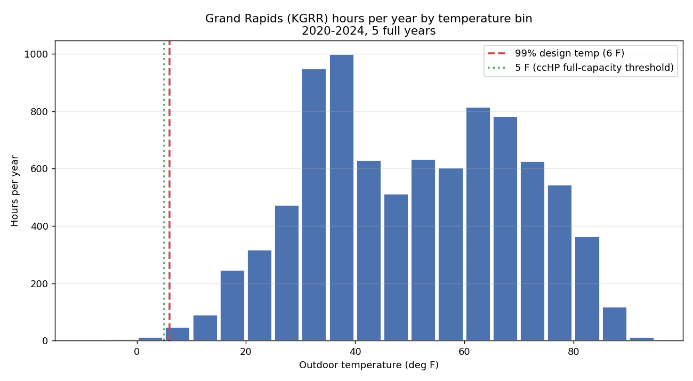
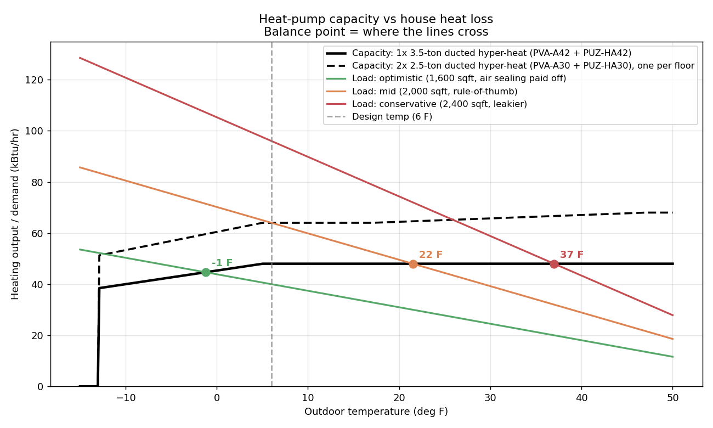
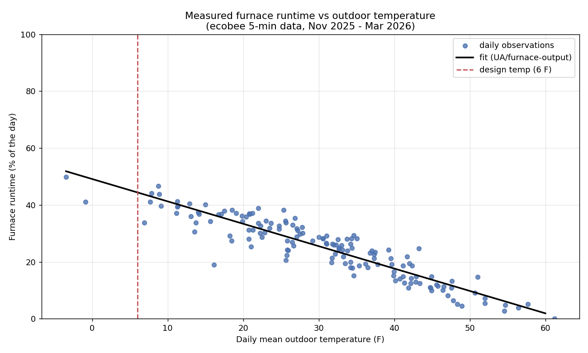

# Climate & balance-point analysis

All figures below are produced by `analyze.py` from **5 full years (2020–2024) of NOAA hourly
temperatures at KGRR** (Grand Rapids / Gerald R. Ford Int'l), 43,829 hourly records. The 2025 ISD
file is partial (ends late August) and was dropped so it can't undercount cold hours.

## 1. How cold does Grand Rapids actually get?

| Metric | Value |
|---|---|
| Coldest hour observed (5 yr) | **−9.9 °F** |
| Warmest hour observed | 94.5 °F |
| Mean temperature | 50.7 °F |
| 99% heating design temp | 6 °F |

Hours per year below each threshold (5-year average):

| Below | Hours/year | Share of year |
|---|---|---|
| 32 °F | 1,524 | 17.4% |
| 17 °F | 225 | 2.6% |
| **6 °F (design temp)** | **22.4** | **0.3%** |
| 5 °F | 16.4 | 0.2% |
| 0 °F | 4.6 | 0.1% |

**The headline: Grand Rapids only spends ~22 hours a year below the design temperature, and under
5 hours a year below 0 °F.** The coldest hour in five years (−9.9 °F) never reached the −13 °F
operating floor of the representative equipment. Cold-climate heat pumps are built precisely for
this: the whole "will it survive the cold?" worry lands in a sliver of the year.

The bulk of the heating season sits in the 25–45 °F range — right where a cold-climate heat pump is
at its most efficient (COP 2.5–3.5), not where it struggles. Full per-bin hours are in
`data/temp-bins.csv`.

## 2. Cold snaps — the part that actually stresses an all-electric system

What matters for going all-electric isn't the average, it's the worst sustained run. Longest
consecutive stretches at or below each threshold over the 5 years:

**At/below 5 °F:**
| When | Duration | Low |
|---|---|---|
| 2024-01-14 → 01-15 | 20 hr | −4.0 °F |
| 2021-02-17 | 14 hr | −9.9 °F |
| 2022-01-16 | 9 hr | 1.9 °F |

**At/below 0 °F:**
| When | Duration | Low |
|---|---|---|
| 2024-01-15 | 14 hr | −4.0 °F |
| 2021-02-17 | 9 hr | −9.9 °F |

The worst case in five years was roughly a day-long dip bottoming near −10 °F — cold, but inside
the equipment's rated range, and short. This is the window where a slightly undersized system would
lean on backup (or a properly sized one would just work harder at lower COP).

## 3. Balance point — capacity vs. your house's heat loss

The **balance point** is the outdoor temperature where the heat pump's output equals the house's
heat loss. Above it, the heat pump carries the whole load. Below it, an all-electric system needs
backup heat (or a bigger/second unit). We test three envelope scenarios (design load @ 6 °F) against
two equipment options — because the load is the one number we don't yet know precisely.

| Envelope scenario | Design load @ 6 °F | 1× 3.5-ton (single) | 2× 2.5-ton (one per floor) |
|---|---|---|---|
| Optimistic — 1,600 sqft, air sealing paid off | 40,000 Btu/hr | balance **−1 °F**, ~4 hr/yr below | balance −12 °F, ~0 hr/yr below |
| Mid — 2,000 sqft, rule-of-thumb | 64,000 Btu/hr | balance 22 °F, ~470 hr/yr below | balance **6 °F**, ~22 hr/yr below |
| Conservative — 2,400 sqft, leakier | 96,000 Btu/hr | balance 37 °F, ~2,520 hr/yr below | balance 26 °F, ~740 hr/yr below |

Reading the table:
- **If your real load is on the low end** (very plausible for a ~1,600–2,000 sqft home you've
  already air-sealed), a **single 3.5-ton hyper-heat covers essentially the entire Grand Rapids
  climate** — balance point below 0 °F, only a few hours a year of any shortfall.
- **If your load is the textbook rule-of-thumb** (~64k), a single unit falls short on the coldest
  ~470 hours, but **two smaller units — one per floor — pull the balance point right down to the
  6 °F design temp** (only ~22 hr/yr below). That two-unit layout *is* your zoning plan.
- **Only the conservative/leaky end** strains even two units. That's the scenario a Manual J and
  targeted envelope work (or accepting a little backup) would address.

The load estimates are practitioner rules of thumb (~35 Btu/hr/sqft for an early-1900s
uninsulated-wall home, adjusted for your air sealing). They span a wide range and tend to *overstate*
load once air sealing is credited — which is exactly why the single highest-value next step is a
contractor **Manual J** to replace this range with your house's real number.

## 4. Estimating your real load from your gas bills (empirical Manual J)

You don't have to guess which scenario you are. Your **heating-season gas use** plus this climate
data backs out your house's real heat-loss coefficient — a measured "bill method" Manual J. The
climate contributes **147,506 heating degree-hours per year** (base 65 °F, from the 5-year data);
dividing your delivered heat by that yields UA, and UA × the design ΔT yields your design load.

| Annual *heating* gas (therms) | Implied UA (Btu/hr·°F) | Design load @ 6 °F | Balance pt, 1× 3.5-ton | Balance pt, 2× 2.5-ton |
|---|---|---|---|---|
| 500 | 271 | 16,800 | −13 °F | −13 °F |
| 700 | 380 | 23,500 | −13 °F | −13 °F |
| 900 | 488 | 30,300 | −12 °F | −13 °F |
| 1,100 | 597 | 37,000 | −4 °F | −13 °F |
| 1,300 | 705 | 43,700 | +2 °F | −9 °F |

**This is the most important table in the analysis.** Even at **1,300 heating therms/year** — heavy
use for a house this size — the implied design load (~44k Btu/hr) is low enough that a **single
3.5-ton cold-climate unit still covers the 6 °F design temperature**. The rule-of-thumb scenarios in
§3 (40k–96k) evidently *overstate* your load; the bill method, grounded in how much heat your house
actually consumed, lands much lower. The practical read: **a single heat pump very likely covers your
whole house all-electric**, and the two-unit option is worth it for *zoning*, not because you need
the capacity.

How to get your number: take your **total annual gas therms and subtract ~12× an average summer
month** (that strips out water heating, cooking, and the dryer, leaving space heating). Plug it into
`YOUR_HEATING_THERMS` at the top of `analyze.py` and re-run for your exact UA, design load, and
balance point.

Caveats (why this is an estimate, not a substitute for a contractor Manual J): it assumes your gas
heat all went to space heating at roughly a 68 °F setpoint and that your furnace's AFUE is as
entered. Night setbacks or a cooler house mean your true UA is a bit higher than inferred; a warmer
house, lower. But as a physics-anchored sanity check on the rule of thumb, it's hard to beat — and it
consistently points to the optimistic end.

## 5. Measured result from your ecobee (the gold standard)

The bill method in §4 is an estimate; your thermostat gives the real thing. `ecobee_analysis.py`
reads **43,204 five-minute records across 150 days (Nov 2025–Mar 2026)** and regresses furnace
runtime against outdoor temperature. Because your furnace is single-stage (only "Heat Stage 1" runs),
runtime is a direct proxy for delivered heat — no rule of thumb required.

What the data measured (not assumed):
- **Setpoint schedule:** ~66 °F daytime, 62 °F asleep, **64.5 °F mean** — you keep the house cool.
- **Heating-onset temperature ≈ 62 °F outdoors** — your real "balance point of internal gains,"
  close to the base-62 the bill method would use (validates §4).
- **Runtime is nearly linear in outdoor temp** (tight scatter around the fit) — textbook heat-loss
  behavior, which is why this method works so well.
- **The headline: your furnace ran only ~50% of the time on the coldest day of the winter
  (−3.5 °F average) and extrapolates to ~44% at the 6 °F design temperature.** Your furnace is
  roughly **twice** the capacity your house's heat loss actually needs.

### Solving your exact numbers — gas cross-check

Converting runtime to absolute Btu needs the furnace's rated output. The nameplate wasn't findable,
but we didn't need it: **gas usage + runtime hours solve it directly.** Over the ecobee period the
furnace ran **897 hours** and burned **~591 therms** of heating gas (from the Consumers Energy chart,
read as average CCF/day × days, minus a summer baseload). Since delivered heat = furnace output ×
runtime hours = gas energy × AFUE:

- **Solved furnace size: ~66,000 BTU/hr input (~63,000 output)** — a mid-size furnace, no panel needed.
- **UA ≈ 493 BTU/hr·°F**
- **Design load ≈ 31,550 BTU/hr** at the 6 °F design temp (sized to hold a comfortable 70 °F)

| | 1× 3.5-ton (single) | 2× 2.5-ton (per floor) |
|---|---|---|
| **Balance point** | **−10.5 °F** | −13 °F |

**Two independent methods agree** — the runtime-slope method (§ above) and this gas-energy method both
land on a ~66k furnace and a ~31,500 BTU/hr design load. And the punchline: a **single 3.5-ton
cold-climate heat pump holds its balance point to −10.5 °F — below the coldest hour in five years of
Grand Rapids weather (−9.9 °F).** In plain terms, a single unit covers essentially *every hour* your
house has seen, all-electric, with no backup heat required. The rule-of-thumb scenarios in §3
overstated your load by roughly 2×; your measured house sits at the optimistic end.

*Comfort note: you currently run the house at ~64.5 °F. These loads are sized to a warmer 70 °F
(people often run heat pumps a touch warmer for even heat). Keep running cool and your real
requirement is even lower. Measured heating energy (~591 therms / ~56 MMBtu over Nov–Mar) is also
well below the rule-of-thumb scenarios, so the absolute cost and carbon deltas in `report.md` are
smaller in reality than those scenario tables suggest.*

### Sniff test & stress test

At **1,800 sqft**, the design load is **~17.5 BTU/hr·sqft** — squarely in the "old house that's been
meaningfully air-sealed" band (15–25), well under the 30–45 rule of thumb for *un*-sealed
uninsulated-wall homes. The number that first looked low is explained by the air sealing you've done,
not by an error.

A **gas fireplace** (living room, evenings, always off before bed) burns gas that shows up in the
utility bill but not in furnace runtime — so it slightly *inflates* the solved furnace output, making
the load estimate marginally conservative. It's off during the overnight design-cold hours, so it
doesn't touch the sizing tail.

Stress-testing the single 3.5-ton unit against a deliberately higher load (in case the true number is
above measured):

| True load vs measured | Design load | 1× 3.5-ton balance point | Hours/yr below balance |
|---|---|---|---|
| ×1.0 (measured) | 31,600 | −10.5 °F | 0 |
| ×1.2 | 37,900 | −3.5 °F | 2 |
| ×1.3 | 41,000 | −0.4 °F | 4 |
| ×1.5 | 47,300 | +5.1 °F | 21 |

**Even a 50% load underestimate still leaves a single 3.5-ton unit covering the design temperature.**
The conclusion is robust with a wide safety margin.

## 6. Seasonal efficiency (from the same data)

Weighting each heating hour's COP by that hour's heat demand gives a **demand-weighted seasonal COP
of ~2.97** for the single 3.5-ton unit — i.e., on average it delivers ~3 units of heat per unit of
electricity across a Grand Rapids winter. (This uses max-capacity COP, so it slightly *understates*
real seasonal efficiency, since inverters run more efficiently at part load.) That seasonal COP
feeds the carbon and operating-cost numbers in `report.md`.
